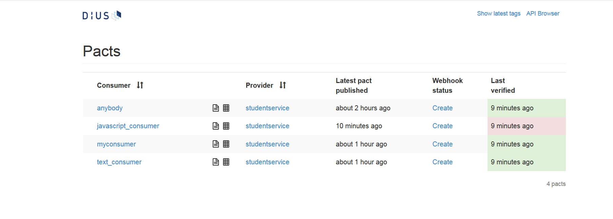
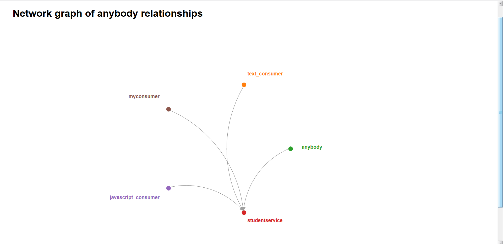
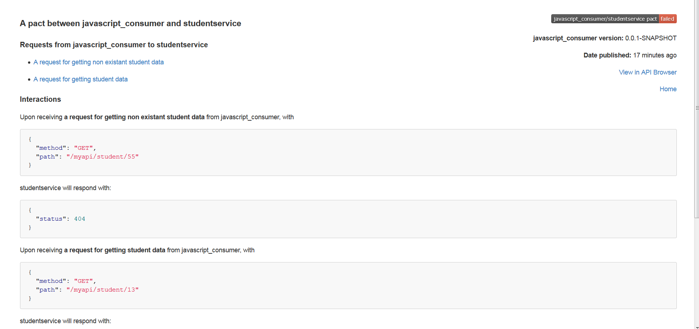

# Using Pact Broker with Consumer and Provider Test Case


## Pact Broker for Uploading Consumer Pacts(using Maven)

The following plugin is needed to be added for this,refer the pom.xml

```xml
<plugin>
 <groupId>au.com.dius</groupId>
 <artifactId>pact-jvm-provider-maven_2.12</artifactId>
 <version>3.5.11</version>
 <configuration>
  <pactDirectory>target/mypacts</pactDirectory>
  <pactBrokerUrl>pact_broker_url</pactBrokerUrl>
  <pactBrokerUsername>pact_broker_userid</pactBrokerUsername>
  <pactBrokerPassword>pact_broker_password</pactBrokerPassword>
 </configuration>
</plugin>
```
then the following maven goal has to be executed mvn pact:publish this is going to upload the pacts from the folder mentioned at <pactDirectory> tag to the specified pact broker
## Pact Broker for Verifying Consumer Pacts from Pact Broker
### Using Annotations
```java
@RunWith(PactRunner.class)
@PactBroker(host = "pact_broker_host_dns_ip", port = "pact_broker_port", protocol = "pact_broker_protocol_http_https", authentication = @PactBrokerAuth(username = "pact_broker_username", password = "pact_broker_password"))
public class ProviderTest {
```

When you get a pact broker you will have the following `pact_broker_host_dns_ip`,`pact_broker_port`,`pact_broker_protocol_http_https`,`pact_broker_username`,`pact_broker_password`

### Using Maven PLugin
```xml
<plugin>
 <groupId>au.com.dius</groupId>
 <artifactId>pact-jvm-provider-maven_2.12</artifactId>
 <version>3.5.11</version>
 <configuration>
  <serviceProviders>
	<serviceProvider>
	 <name>studentservice</name>
	 <protocol>http</protocol>
	 <host>localhost</host>
	 <port>8095</port>
	 <path>/</path>
	 <pactBroker>
	  <url>pact_broker_url</url>
	  <authentication>
		<username>pact_broker_userid</username>
		<password>pact_broker_password</password>
	  </authentication>
	 </pactBroker>
	</serviceProvider>
   </serviceProviders>
 </configuration>
</plugin>
```
then the following maven goal has to be executed mvn pact:verify this is going to connect to the pact broker and verify against the provider based on the `<name>`
## Visualising the Pacts in Pact Broker
### Pact Status

### API Interconnectivity

The links are clickable and show the interactions


